  &emsp;
  &emsp;
  &emsp;
  &emsp;
  &emsp;
  <!-- visitor -->
  &emsp;

## Hi! Nice to meet you!

- 👋 Hi, I'm @Peaceuai-github
- 👀 I'm interest in Java, Python, HTML5, CSS, JavaScript, Spring, MyBatis, MySQL, Oracle, Redis, Linux, etc.
- 🌱 I'm currently learning Oracle, AI, OceanBase.
- 💞️ I'm looking for partners in open-source code.
- 📫 How to reach me? Email: jimpeaceuai@gmail.com

<h3 align="left">Languages:</h3>

 <a> Java </a> &nbsp &nbsp
 <a> Python </a>&nbsp &nbsp 
 <a> HTML5 </a>&nbsp &nbsp 
 <a> CSS </a>&nbsp &nbsp 
 <a> JavaScript </a>&nbsp &nbsp

<h3 align="left">Tools:</h3>

 <a> Spring </a>&nbsp &nbsp 
 <a> MySQL </a>&nbsp &nbsp 
 <a> Oracle </a>&nbsp &nbsp 
 <a> VueJs </a>&nbsp &nbsp
 <a> React </a>&nbsp &nbsp
 <a> Git </a>&nbsp &nbsp 
<a href="https://www.linux.org/" target="_blank" rel="noreferrer">  <a> Linux </a> &nbsp &nbsp 
<a href="https://www.docker.com/" target="_blank" rel="noreferrer">  <a> Docker </a> &nbsp &nbsp 
 <a> Redis </a> &nbsp &nbsp 
 <a> Jenkins </a> &nbsp &nbsp 
 <a> Postman </a>

<h3 align="left"> :computer:  Github Stats  </h3>

<h3 align="left"> :trophy:  Github Profile Trophy  </h3>

<h3 align="left"> :calendar:  Github Contributions  </h3>

